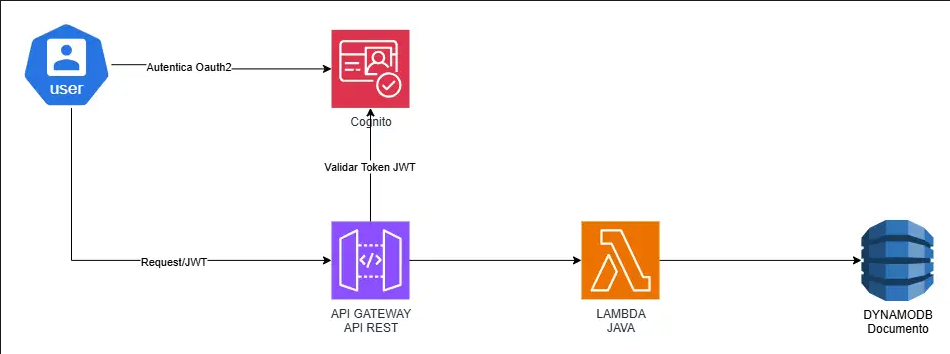

# 📚 CRUD de Libros con AWS Cognito, API Gateway, Lambda y DynamoDB

Este proyecto implementa una arquitectura **serverless** en AWS para gestionar un CRUD de libros con autenticación segura vía Amazon Cognito.

## 🚀 Arquitectura
- **Amazon Cognito**: Autenticación de usuarios (OAuth2 / JWT tokens con scopes `read` y `write`)
- **API Gateway**: Expone endpoints REST y protege con Cognito Authorizer
- **AWS Lambda (Java)**: Lógica del CRUD
- **DynamoDB**: Base de datos NoSQL para almacenar los libros

## 📂 Estructura del repositorio
- `src/` → Código fuente Java (CRUD)
- `postman/` → Colección de Postman con ejemplos
- `docs/` → Diagramas de arquitectura y flujos
- `README.md` → Esta guía

## 🛠️ Endpoints disponibles
- `GET /items` → Listar libros (scope: `read`)
- `GET /items/{id}` → Obtener un libro (scope: `read`)
- `POST /items` → Crear libro (scope: `write`)
- `PUT /items` → Actualizar libro (scope: `write`)
- `DELETE /items/{id}` → Eliminar libro (scope: `write`)

## 🔑 Autenticación y Autorización
- Usuarios se autentican en Cognito (Hosted UI).
- Obtienen `access_token` y lo envían en cada request:
  `Authorization` : `Bearer <access_token>`

## 📝 Requisitos previos
- Cuenta AWS con Cognito, API Gateway, Lambda y DynamoDB configurados.
- Maven (`pom.xml`) para compilar y empacar el Lambda.
- Postman para probar la API (colección incluida).

---
💡 **Nota**: Este proyecto es una demo de integración serverless en AWS con control de acceso vía OAuth2 scopes.